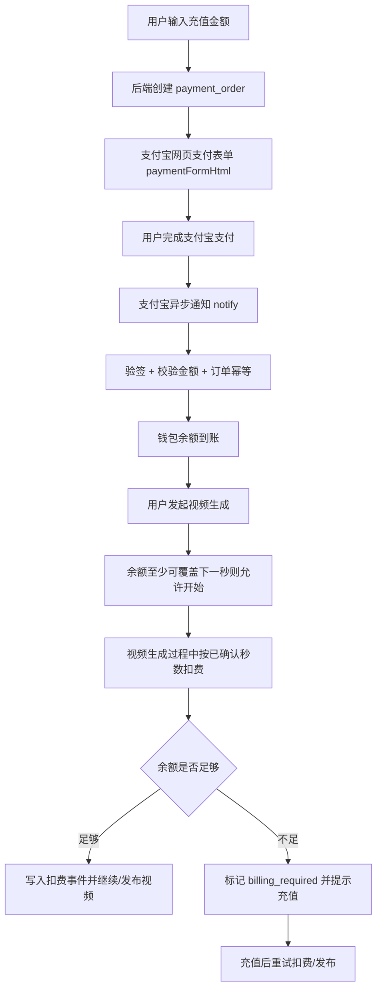

# 支付宝余额与视频按秒扣费实施文档

> **For agentic workers:** REQUIRED SUB-SKILL: Use superpowers:subagent-driven-development (recommended) or superpowers:executing-plans to implement this plan task-by-task. Steps use checkbox (`- [ ]`) syntax for tracking.

**Goal:** 在 AiDrama 中落地一条纯余额制链路：用户通过支付宝充值，支付成功后余额到账；用户生成视频时不做预估费用，按已经确认生成的视频秒数从余额实时或分段扣费；余额不足时阻止继续结算并提醒用户充值。

**Architecture:** 支付订单只负责充值；钱包账户只保存人民币余额；视频生成链路通过独立的扣费服务写入幂等扣费事件。支付宝异步通知是到账唯一可信来源，前端返回页只用于展示结果。

**Tech Stack:** 后端 Hono + TypeScript + MySQL/mysql2 + Drizzle schema；前端 Vue 3 + Vite；支付宝使用 `alipay-sdk`；金额计算使用 `decimal.js`。

---

## 范围锁定

本次只做这些能力：

- 支付宝网页支付充值。
- 充值订单、订单状态查询、支付宝异步通知验签。
- 用户钱包余额，单位为元，数据库和接口都保留两位小数。
- 视频按实际生成秒数扣费，默认 `1.00` 元/秒。
- 余额不足时提示充值，未完成扣费的视频不能作为已结算成品交付。

本次明确不做这些能力：

- 套餐、VIP 会员、邀请码。
- 额外积分充值套餐。
- 视频生成前的预估费用、预扣费、冻结余额。
- 用“分”作为金额单位或整型分存储。

旧项目 `E:\Desktop\Drama` 可迁移的只有支付宝 SDK 初始化、`alipay.trade.page.pay` 表单生成、`checkNotifySign` 验签、订单幂等处理思路。旧项目里的 VIP、积分、邀请码、套餐逻辑不要迁移。旧项目中把支付宝表单 HTML 命名成 `qrCodeUrl`，新项目统一命名为 `paymentFormHtml`。

---

## 目标流程



扣费原则：

- 不根据用户填写的生成时长计算预估费用。
- 用户充多少用多少。
- 扣费来源只能是“已经确认生成的视频秒数”。
- 如果供应商能返回进度秒数，按增量秒数扣费。
- 如果当前供应商只在完成后返回结果，第一版在完成回调中按最终秒数一次结算；这仍然不是预估费用。
- 完成回调中余额不足时，保存待结算结果，状态显示为 `billing_required`，前端提醒充值；充值后调用重试结算接口，扣费成功后再发布视频。

---

## 金额规范

全项目用“元”表示金额：

- 数据库金额字段统一 `DECIMAL(12,2)`。
- API 金额统一返回字符串，例如 `"100.00"`。
- 请求体金额也用字符串，例如 `{ "amount": "50.00" }`。
- 价格配置 `video_price_per_second` 使用 `DECIMAL(12,2)`，默认 `"1.00"`。
- 不能用 JavaScript `number` 做金额加减乘除，统一通过 `decimal.js`。
- 所有金额入库前必须格式化成两位小数字符串。

金额工具放在 `backend/src/services/billing/money.ts`：

```ts
import Decimal from 'decimal.js'

Decimal.set({ precision: 20, rounding: Decimal.ROUND_HALF_UP })

export type MoneyString = string

export function toMoney(value: string | number | Decimal): MoneyString {
  return new Decimal(value).toDecimalPlaces(2).toFixed(2)
}

export function money(value: string | number | Decimal) {
  return new Decimal(value).toDecimalPlaces(2)
}

export function assertRechargeAmount(value: unknown) {
  if (typeof value !== 'string' || !/^\d+(\.\d{2})$/.test(value)) {
    throw new Error('充值金额必须是两位小数字符串')
  }
  const amount = money(value)
  if (amount.lt('1.00') || amount.gt('9999.00')) {
    throw new Error('充值金额必须在 1.00 到 9999.00 之间')
  }
  return amount.toFixed(2)
}
```

---

## 数据库变更

修改 `backend/src/db/schema.ts`，引入 `decimal`：

```ts
import { mysqlTable, text, int, double, boolean, primaryKey, varchar, decimal } from 'drizzle-orm/mysql-core'
```

在 `backend/src/db/index.ts` 的 `tableStatements` 中新增表和列，保持现有项目“启动时建表/补列”的风格。每个金额字段都使用 `DECIMAL`，不要替换成整数分。

### 钱包账户

```sql
CREATE TABLE IF NOT EXISTS wallet_accounts (
  user_id INT PRIMARY KEY,
  balance DECIMAL(12,2) NOT NULL DEFAULT 0.00,
  total_recharged DECIMAL(12,2) NOT NULL DEFAULT 0.00,
  total_consumed DECIMAL(12,2) NOT NULL DEFAULT 0.00,
  created_at VARCHAR(32) NOT NULL,
  updated_at VARCHAR(32) NOT NULL
)
```

### 钱包流水

```sql
CREATE TABLE IF NOT EXISTS wallet_transactions (
  id INT AUTO_INCREMENT PRIMARY KEY,
  transaction_no VARCHAR(64) NOT NULL UNIQUE,
  user_id INT NOT NULL,
  amount DECIMAL(12,2) NOT NULL,
  balance_after DECIMAL(12,2) NOT NULL,
  type VARCHAR(32) NOT NULL,
  related_order_no VARCHAR(64),
  related_video_generation_id INT,
  description TEXT,
  created_at VARCHAR(32) NOT NULL,
  INDEX idx_wallet_transactions_user_created (user_id, created_at),
  INDEX idx_wallet_transactions_order (related_order_no),
  INDEX idx_wallet_transactions_video (related_video_generation_id)
)
```

流水类型固定为：

- `recharge`：支付宝充值到账，金额为正数。
- `video_charge`：视频扣费，金额为负数。
- `adjustment`：人工调账入口预留给运维脚本使用，本次不做前端入口。

### 充值订单

```sql
CREATE TABLE IF NOT EXISTS payment_orders (
  id INT AUTO_INCREMENT PRIMARY KEY,
  order_no VARCHAR(64) NOT NULL UNIQUE,
  user_id INT NOT NULL,
  amount DECIMAL(12,2) NOT NULL,
  status VARCHAR(32) NOT NULL DEFAULT 'pending',
  provider VARCHAR(32) NOT NULL DEFAULT 'alipay',
  alipay_trade_no VARCHAR(64),
  alipay_app_id VARCHAR(64),
  alipay_seller_id VARCHAR(64),
  raw_notify TEXT,
  paid_at VARCHAR(32),
  created_at VARCHAR(32) NOT NULL,
  updated_at VARCHAR(32) NOT NULL,
  INDEX idx_payment_orders_user_created (user_id, created_at),
  INDEX idx_payment_orders_status (status)
)
```

订单状态固定为：

- `pending`
- `paid`
- `failed`
- `closed`

### 计费配置

```sql
CREATE TABLE IF NOT EXISTS billing_settings (
  setting_key VARCHAR(64) PRIMARY KEY,
  setting_value DECIMAL(12,2) NOT NULL,
  updated_at VARCHAR(32) NOT NULL
)
```

启动初始化时插入默认配置：

```sql
INSERT IGNORE INTO billing_settings (setting_key, setting_value, updated_at)
VALUES ('video_price_per_second', 1.00, ?)
```

提供脚本 `backend/src/scripts/set-video-price.ts`，用环境变量调整价格：

```powershell
$env:VIDEO_PRICE_PER_SECOND='1.20'
npm run billing:set-video-price
```

对应 `backend/package.json` 新增脚本：

```json
{
  "scripts": {
    "billing:set-video-price": "tsx src/scripts/set-video-price.ts"
  }
}
```

### 视频扣费事件

```sql
CREATE TABLE IF NOT EXISTS video_billing_events (
  id INT AUTO_INCREMENT PRIMARY KEY,
  event_no VARCHAR(64) NOT NULL UNIQUE,
  user_id INT NOT NULL,
  video_generation_id INT NOT NULL,
  seconds_delta DECIMAL(10,2) NOT NULL,
  price_per_second DECIMAL(12,2) NOT NULL,
  amount DECIMAL(12,2) NOT NULL,
  billed_total_seconds DECIMAL(10,2) NOT NULL,
  wallet_transaction_no VARCHAR(64) NOT NULL,
  idempotency_key VARCHAR(128) NOT NULL UNIQUE,
  created_at VARCHAR(32) NOT NULL,
  INDEX idx_video_billing_user_created (user_id, created_at),
  INDEX idx_video_billing_generation (video_generation_id)
)
```

在 `video_generations` 增加结算字段：

```sql
ALTER TABLE video_generations ADD COLUMN billing_status VARCHAR(32) NOT NULL DEFAULT 'unbilled'
ALTER TABLE video_generations ADD COLUMN billed_seconds DECIMAL(10,2) NOT NULL DEFAULT 0.00
ALTER TABLE video_generations ADD COLUMN billing_amount DECIMAL(12,2) NOT NULL DEFAULT 0.00
ALTER TABLE video_generations ADD COLUMN billing_error TEXT
ALTER TABLE video_generations ADD COLUMN pending_video_url TEXT
ALTER TABLE video_generations ADD COLUMN pending_duration_seconds DECIMAL(10,2)
```

`billing_status` 固定为：

- `unbilled`
- `billing`
- `settled`
- `billing_required`
- `billing_failed`

---

## 后端服务拆分

### 1. 依赖和环境

修改 `backend/package.json`、`backend/package-lock.json`：

```powershell
cd backend
npm install alipay-sdk decimal.js
```

新增环境变量名称，值放入部署环境，不写进代码：

```env
ALIPAY_APP_ID=
ALIPAY_PRIVATE_KEY=
ALIPAY_PUBLIC_KEY=
ALIPAY_GATEWAY=https://openapi.alipay.com/gateway.do
PUBLIC_API_BASE_URL=
```

`PUBLIC_API_BASE_URL` 用来拼接支付宝回调地址：

- `POST {PUBLIC_API_BASE_URL}/api/v1/payments/alipay/notify`
- `GET {PUBLIC_API_BASE_URL}/api/v1/payments/alipay/return`

### 2. 钱包服务

新增 `backend/src/services/billing/wallet.ts`。

对外函数：

```ts
export async function getOrCreateWallet(userId: number): Promise<WalletAccount>
export async function getWalletTransactions(userId: number, limit: number): Promise<WalletTransaction[]>
export async function creditWalletForRecharge(params: RechargeCreditParams): Promise<WalletAccount>
export async function debitWalletForVideo(params: VideoDebitParams): Promise<WalletAccount>
export async function assertCanStartVideo(userId: number): Promise<void>
```

实现要求：

- 所有余额更新都必须在 MySQL 事务内完成。
- 扣费时使用 `SELECT ... FOR UPDATE` 锁住 `wallet_accounts` 当前用户行。
- `creditWalletForRecharge` 只能由支付订单服务调用。
- `debitWalletForVideo` 只能由视频扣费服务调用。
- 余额不足时抛出带 `code: 'INSUFFICIENT_BALANCE'` 的错误。
- `assertCanStartVideo` 不计算预估总费用，只检查余额是否至少覆盖当前一秒价格；如果连下一秒都不足，直接拒绝生成并提示充值。

扣费事务核心逻辑：

```ts
const nextBalance = money(account.balance).minus(amount)
if (nextBalance.lt(0)) throw insufficientBalance()

await conn.execute(
  `UPDATE wallet_accounts
      SET balance = ?, total_consumed = total_consumed + ?, updated_at = ?
    WHERE user_id = ?`,
  [toMoney(nextBalance), toMoney(amount), now(), userId],
)

await conn.execute(
  `INSERT INTO wallet_transactions (
     transaction_no, user_id, amount, balance_after, type,
     related_video_generation_id, description, created_at
   ) VALUES (?, ?, ?, ?, 'video_charge', ?, ?, ?)`,
  [transactionNo, userId, `-${toMoney(amount)}`, toMoney(nextBalance), videoGenerationId, description, now()],
)
```

### 3. 计费配置服务

新增 `backend/src/services/billing/billing-settings.ts`。

对外函数：

```ts
export async function getVideoPricePerSecond(): Promise<MoneyString>
export async function setVideoPricePerSecond(value: string): Promise<MoneyString>
```

实现要求：

- 默认值来自 `billing_settings.video_price_per_second`。
- `setVideoPricePerSecond` 只由 `backend/src/scripts/set-video-price.ts` 调用。
- 价格必须是两位小数字符串，范围 `0.01` 到 `999.99`。

### 4. 支付宝服务

新增 `backend/src/services/payments/alipay.ts`。

对外函数：

```ts
export function createAlipayPagePayForm(params: {
  orderNo: string
  amount: string
  subject: string
  body: string
  returnUrl: string
  notifyUrl: string
}): string

export function verifyAlipayNotify(params: Record<string, unknown>): boolean
```

实现要求：

- SDK 使用 `AlipaySdk`。
- `pageExec('alipay.trade.page.pay', ...)` 返回的是表单 HTML，接口字段命名为 `paymentFormHtml`。
- 支付宝公钥缺失时验签必须失败，生产环境不能跳过验签。
- 日志中只能记录 `appId`、`gateway`、`orderNo`，不能记录私钥、公钥、签名原文。

网页支付参数：

```ts
const bizContent = {
  outTradeNo: orderNo,
  productCode: 'FAST_INSTANT_TRADE_PAY',
  totalAmount: amount,
  subject: `AiDrama 余额充值 ${amount} 元`,
  body: `AiDrama 视频生成余额充值 ${amount} 元`,
}
```

### 5. 支付订单服务

新增 `backend/src/services/payments/payment-orders.ts`。

对外函数：

```ts
export async function createRechargeOrder(userId: number, amount: string): Promise<CreateRechargeOrderResult>
export async function getPaymentOrderForUser(userId: number, orderNo: string): Promise<PaymentOrder | null>
export async function handleAlipayNotify(params: Record<string, unknown>): Promise<'success' | 'fail'>
```

`createRechargeOrder`：

- 校验充值金额。
- 生成订单号，建议格式 `R${yyyyMMddHHmmss}${random}`。
- 插入 `payment_orders`，状态为 `pending`。
- 调用支付宝服务生成 `paymentFormHtml`。
- 返回 `{ orderNo, amount, paymentFormHtml }`。

`handleAlipayNotify`：

- 验签失败返回 `fail`。
- 只处理 `TRADE_SUCCESS` 和 `TRADE_FINISHED`。
- 用 `out_trade_no` 查询本地订单。
- 校验 `total_amount` 必须等于本地订单 `amount`。
- 在事务中锁定订单行和钱包行。
- 如果订单已是 `paid`，直接返回 `success`，不能重复加余额。
- 更新订单为 `paid`，保存支付宝交易号、应用 ID、卖家 ID、原始通知。
- 调用钱包入账，插入 `wallet_transactions` 的 `recharge` 流水。
- 事务提交后返回 `success`。

### 6. 视频扣费服务

新增 `backend/src/services/billing/video-billing.ts`。

对外函数：

```ts
export async function billVideoSeconds(params: {
  userId: number
  videoGenerationId: number
  confirmedTotalSeconds: string
  idempotencyKey: string
}): Promise<VideoBillingResult>

export async function settleCompletedVideo(params: {
  userId: number
  videoGenerationId: number
  videoUrl: string
  durationSeconds: string
}): Promise<'settled' | 'billing_required'>

export async function retryVideoSettlement(userId: number, videoGenerationId: number): Promise<'settled'>
```

`billVideoSeconds` 规则：

- `confirmedTotalSeconds` 是当前已经确认生成的累计秒数，不是请求时长预估。
- 查询当前 `video_generations.billed_seconds`。
- `seconds_delta = confirmedTotalSeconds - billed_seconds`。
- `seconds_delta <= 0` 时返回已有结果，不扣费。
- `amount = seconds_delta * 当前 price_per_second`，金额四舍五入到两位小数。
- 使用 `idempotency_key` 防重复扣费。
- 钱包扣费成功后插入 `video_billing_events`。
- 更新 `video_generations.billed_seconds`、`billing_amount`、`billing_status`。

`settleCompletedVideo` 规则：

- 在 `backend/src/services/generation/video-generation.ts` 的 `completeGeneratedVideo` 中调用。
- 调用位置必须在把 `videoUrl` 发布到可见字段之前。
- 扣费成功后再调用原有 `completeGeneratedVideoJob` 发布视频。
- 余额不足时不发布 `videoUrl`，把地址保存到 `pending_video_url`，把秒数保存到 `pending_duration_seconds`，状态设为 `billing_required`，错误信息写入 `billing_error`。
- `retryVideoSettlement` 在用户充值后重新扣费；扣费成功后发布 `pending_video_url` 并清空待发布字段。

如果供应商提供实时进度秒数，进度回调中直接调用：

```ts
await billVideoSeconds({
  userId,
  videoGenerationId,
  confirmedTotalSeconds,
  idempotencyKey: `video:${videoGenerationId}:seconds:${confirmedTotalSeconds}`,
})
```

当前供应商只提供完成结果时，完成回调中调用：

```ts
await settleCompletedVideo({
  userId,
  videoGenerationId,
  videoUrl: source,
  durationSeconds: String(duration),
})
```

---

## 后端路由

### 路由挂载

修改 `backend/src/app.ts`：

```ts
import payments from './routes/actions/payments.js'
import wallet from './routes/resources/wallet.js'

api.route('/payments', payments)
api.route('/wallet', wallet)
```

支付通知需要公开访问。修改 `backend/src/middleware/auth-policy.ts`：

```ts
export function isPublicApiPath(pathname: string) {
  return pathname === '/api/v1/health'
    || pathname.startsWith('/api/v1/auth/')
    || pathname === '/api/v1/assets/proxy'
    || pathname === '/api/v1/payments/alipay/notify'
    || pathname === '/api/v1/payments/alipay/return'
}
```

### 支付接口

新增 `backend/src/routes/actions/payments.ts`：

- `POST /api/v1/payments/recharge-orders`
- `GET /api/v1/payments/orders/:orderNo`
- `POST /api/v1/payments/alipay/notify`
- `GET /api/v1/payments/alipay/return`

接口行为：

```http
POST /api/v1/payments/recharge-orders
Authorization: Bearer <token>
Content-Type: application/json

{ "amount": "100.00" }
```

返回：

```json
{
  "code": 0,
  "data": {
    "orderNo": "R202606171530001234",
    "amount": "100.00",
    "paymentFormHtml": "<form ...></form>"
  },
  "message": "ok"
}
```

支付宝异步通知返回纯文本：

- 成功：`success`
- 失败：`fail`

支付宝同步返回页不能入账，只展示“支付处理中，请返回页面查看余额”，或跳转到 `/wallet?orderNo=...`。

### 钱包接口

新增 `backend/src/routes/resources/wallet.ts`：

- `GET /api/v1/wallet`
- `GET /api/v1/wallet/transactions?limit=20`
- `GET /api/v1/wallet/video-price`

钱包返回：

```json
{
  "balance": "128.50",
  "totalRecharged": "300.00",
  "totalConsumed": "171.50",
  "videoPricePerSecond": "1.00"
}
```

交易流水返回：

```json
{
  "items": [
    {
      "transactionNo": "WT202606171530001234",
      "amount": "-8.00",
      "balanceAfter": "120.50",
      "type": "video_charge",
      "description": "视频生成扣费 8.00 秒 x 1.00 元/秒",
      "createdAt": "2026-06-17T15:30:00.000Z"
    }
  ]
}
```

### 视频路由改造

修改 `backend/src/routes/resources/videos.ts`：

- `POST /api/v1/videos` 创建生成任务前调用 `assertCanStartVideo(user.id)`。
- 余额不足时返回 `400`：

```json
{
  "code": 400,
  "data": { "reason": "INSUFFICIENT_BALANCE" },
  "message": "余额不足，请先充值"
}
```

- 新增 `POST /api/v1/videos/:id/billing/retry`，用户充值后重试待结算视频。
- `GET /api/v1/videos/:id` 和列表返回中增加 `billingStatus`、`billedSeconds`、`billingAmount`。

---

## 前端改造

### API 封装

修改 `frontend/src/composables/useApi.ts`，新增类型和 API：

```ts
export type WalletSummary = {
  balance: string
  totalRecharged: string
  totalConsumed: string
  videoPricePerSecond: string
}

export type RechargeOrder = {
  orderNo: string
  amount: string
  paymentFormHtml: string
}

export const walletAPI = {
  get: () => api.get<WalletSummary>('/wallet'),
  transactions: (limit = 20) => api.get<{ items: WalletTransaction[] }>(`/wallet/transactions?limit=${limit}`),
  videoPrice: () => api.get<{ videoPricePerSecond: string }>('/wallet/video-price'),
}

export const paymentAPI = {
  createRechargeOrder: (amount: string) => api.post<RechargeOrder>('/payments/recharge-orders', { amount }),
  getOrder: (orderNo: string) => api.get<PaymentOrder>(`/payments/orders/${orderNo}`),
}
```

### 钱包页面

新增：

- `frontend/src/pages/WalletView.vue`
- `frontend/src/assets/wallet.css`

修改 `frontend/src/router.ts`：

```ts
import WalletView from './pages/WalletView.vue'

{ path: '/wallet', name: 'wallet', component: WalletView, meta: { requiresAuth: true } }
```

页面功能：

- 展示当前余额、累计充值、累计消耗、当前视频单价。
- 充值金额输入，必须是两位小数。
- 常用快捷金额按钮：`10.00`、`50.00`、`100.00`、`500.00`。
- 创建充值订单后，把 `paymentFormHtml` 写入临时容器并自动提交表单。
- 从支付宝返回后根据 `orderNo` 轮询订单状态和余额，最长轮询 30 秒。
- 展示钱包流水，收入用正金额，视频扣费用负金额。

### 生成视频余额提醒

修改视频生成触发处，优先使用现有错误弹窗机制：

- 如果创建视频接口返回 `INSUFFICIENT_BALANCE`，弹出“余额不足，请先充值”，按钮跳转 `/wallet`。
- 如果视频状态返回 `billing_required`，展示“视频已生成，余额不足，充值后可继续结算”，按钮调用 `POST /api/v1/videos/:id/billing/retry`。
- 生成按钮旁展示余额和当前单价，但不展示预估总费用。

---

## 测试清单

### 后端单元测试

新增测试文件：

- `backend/src/services/__tests__/money.test.ts`
- `backend/src/services/__tests__/wallet.test.ts`
- `backend/src/services/__tests__/payment-orders.test.ts`
- `backend/src/services/__tests__/video-billing.test.ts`
- `backend/src/routes/__tests__/payment-route-policy.test.ts`
- `backend/src/routes/__tests__/wallet-route-policy.test.ts`

测试点：

- 金额字符串必须两位小数。
- `0.1 + 0.2` 类场景不会产生浮点误差。
- 重复支付宝通知只入账一次。
- 支付宝通知金额和本地订单金额不一致时返回 `fail`。
- 钱包余额不足时不能扣成负数。
- 视频扣费事件使用同一个 `idempotency_key` 重放时不重复扣费。
- `billing_required` 视频在充值后可以通过重试结算发布。
- `/api/v1/payments/alipay/notify` 不需要登录。
- 充值下单、钱包查询、视频重试结算需要登录。

后端验证命令：

```powershell
cd backend
npm run typecheck
npm test
```

### 前端验证

前端验证命令：

```powershell
cd frontend
npm run typecheck
npm run test:layout
npm run build
```

人工验证场景：

1. 未登录访问 `/wallet` 会跳转登录。
2. 输入 `10`、`10.0`、`abc` 不能创建充值订单。
3. 输入 `10.00` 可以创建支付宝表单并跳转。
4. 模拟支付宝成功通知后余额增加 `10.00`。
5. 重放同一条支付宝通知后余额不再增加。
6. 余额为 `0.00` 时发起视频生成会提示充值。
7. 余额足够时视频生成成功并按实际秒数扣费。
8. 完成视频结算时余额不足，视频状态为 `billing_required`，充值后重试结算可发布。

---

## 实施任务

- [ ] 安装后端依赖 `alipay-sdk`、`decimal.js`，新增支付宝和价格配置环境变量说明。
- [ ] 在 `backend/src/db/schema.ts` 和 `backend/src/db/index.ts` 增加钱包、订单、计费配置、视频扣费事件表，以及 `video_generations` 结算字段。
- [ ] 新增 `backend/src/services/billing/money.ts`，统一金额解析、格式化、校验。
- [ ] 新增 `backend/src/services/billing/billing-settings.ts` 和 `backend/src/scripts/set-video-price.ts`，支持修改每秒价格。
- [ ] 新增 `backend/src/services/billing/wallet.ts`，实现钱包查询、充值入账、视频扣费、余额不足错误。
- [ ] 新增 `backend/src/services/payments/alipay.ts`，实现支付宝表单生成和通知验签。
- [ ] 新增 `backend/src/services/payments/payment-orders.ts`，实现充值订单、订单查询、支付宝通知到账。
- [ ] 新增 `backend/src/routes/actions/payments.ts` 和 `backend/src/routes/resources/wallet.ts`，并修改 `backend/src/app.ts`、`backend/src/middleware/auth-policy.ts` 挂载路由和放行支付宝回调。
- [ ] 新增 `backend/src/services/billing/video-billing.ts`，并修改 `backend/src/routes/resources/videos.ts`、`backend/src/services/generation/video-generation.ts` 接入开始前余额检查、完成时结算、充值后重试结算。
- [ ] 修改 `frontend/src/composables/useApi.ts`、`frontend/src/router.ts`，新增 `frontend/src/pages/WalletView.vue`、`frontend/src/assets/wallet.css`。
- [ ] 在视频生成入口增加余额不足和 `billing_required` 的用户提示，不展示预估总费用。
- [ ] 增加后端测试和前端验证，执行全部验证命令。

---

## 发布前检查

- 支付宝后台的授权产品包含电脑网站支付。
- 支付宝后台回调地址和 `PUBLIC_API_BASE_URL` 拼出的地址完全一致。
- `ALIPAY_PUBLIC_KEY` 已配置，通知验签失败不会入账。
- 数据库已备份。
- `billing_settings.video_price_per_second` 已确认为 `1.00` 或运营指定价格。
- 生产日志不会打印支付宝私钥、公钥、签名明文。
- 支付成功后只依赖异步通知入账，同步返回页不会直接加余额。
- 视频未完成扣费时，前端不可展示可播放成品地址。


